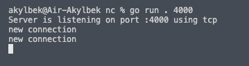
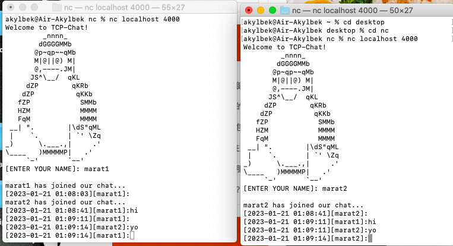

# net-cat

# Usage

```sh
$ ./TCPChat
```

or
```sh
$ ./TCPChat <port>
```

then on new terminals run clients on the same port that the server is listening to
```sh
$ nc localhost <port>
```
<br>
 </br>
<br>
 </br>
